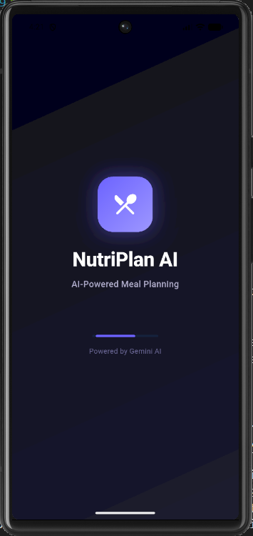
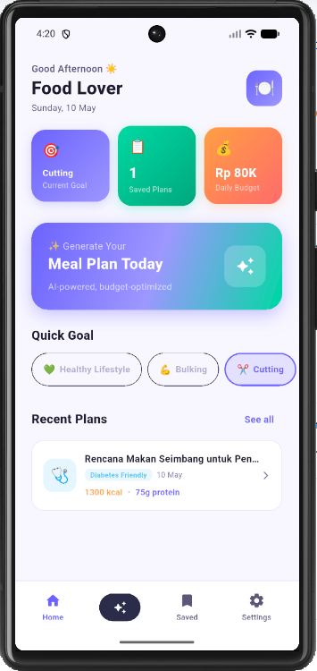
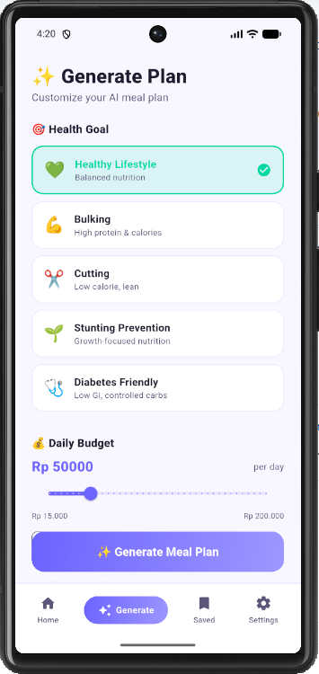
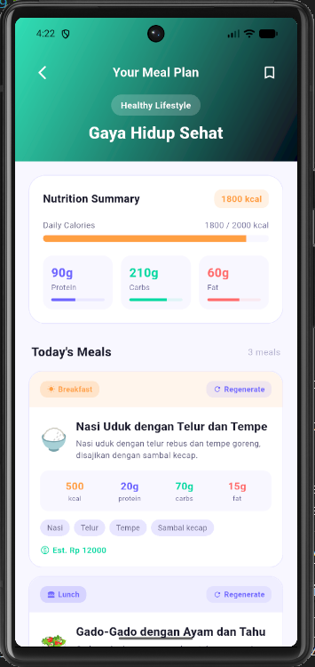
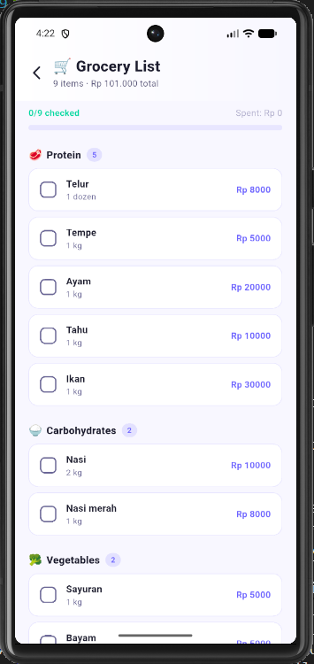
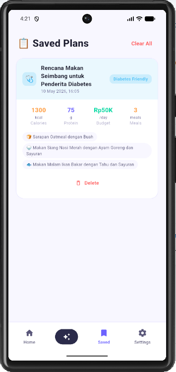
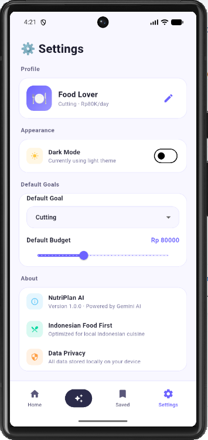

# NutriPlan AI - Mobile Nutrition Planning App

**Tugas Minggu 10: Implementasi AI pada Mobile App**

**Nama:** Nicholas  
**NRP:** 5025231031

---

## Deskripsi Proyek

NutriPlan AI adalah aplikasi mobile Flutter yang mengintegrasikan AI (Groq API) untuk membuat rencana makan yang dipersonalisasi berdasarkan tujuan kesehatan, budget, preferensi makanan, dan pembatasan alergi pengguna.

---

## Fitur Utama

### 1. **Onboarding & Splash Screen**
   - Antarmuka welcome screen yang menarik dengan animasi
   - Panduan fitur-fitur aplikasi dalam bentuk carousel
   - Penyimpanan status onboarding menggunakan Riverpod & SharedPreferences

### 2. **Halaman Home**
   - Dashboard dengan ringkasan rencana makan terbaru
   - Statistik profil pengguna (health goal, meals per day)
   - Navigasi cepat ke fitur-fitur lain

### 3. **Generate Meal Plan (AI Integration)**
   - Pemilihan health goal (Healthy Lifestyle, Bulking, Cutting, Stunting Prevention, Diabetes Friendly)
   - Pengaturan budget harian dengan slider (Rp 15.000 - Rp 200.000)
   - Jumlah meals per day (3, 4, atau 5)
   - Input preferensi makanan bebas
   - Pemilihan alergi/pembatasan (Gluten, Dairy, Nuts, Seafood, Eggs, Soy)
   - Tombol Generate untuk memanggil AI dan menghasilkan meal plan lengkap

### 4. **Meal Plan Result**
   - Tampilan detail nutrisi harian (calories, protein, carbs, fat)
   - Daftar meal cards untuk setiap meal
   - Opsi regenerasi individual meal (cheaper, high protein, simpler)
   - Akses ke grocery list
   - Tombol simpan rencana ke lokal storage

### 5. **Grocery List**
   - Daftar belanja otomatis berdasarkan ingredients dari meal plan
   - Kategori: Protein, Vegetables, Fruits, Carbohydrates, Seasoning, Dairy, Beverages
   - Estimasi harga dalam IDR
   - Tracking total cost

### 6. **Saved Plans**
   - Penyimpanan rencana makan ke local Hive database
   - Daftar semua rencana tersimpan dengan metadata
   - Opsi hapus rencana
   - Akses cepat ke detail rencana

### 7. **Settings**
   - Toggle dark/light theme
   - Informasi aplikasi dan developer

---
---
## Screenshot Project













---

## Tech Stack

### Framework & Language
- **Flutter** - Cross-platform mobile development
- **Dart** - Primary language
- **Riverpod** - State management & dependency injection

### Storage & Data
- **Hive** - Local NoSQL database (untuk saved meal plans)
- **SharedPreferences** - Lightweight key-value storage (onboarding status, theme preference)

### API & Networking
- **Groq API** - AI service untuk meal plan generation

### UI & UX
- **Flutter Animate** - Animation library
- **Shimmer** - Loading placeholder effects
- **Smooth Page Indicator** - Carousel indicator
- **Go Router** - Navigation & deep linking

### Utilities
- **intl** - Localization & formatting
- **uuid** - Unique ID generation
- **path_provider** - File system access

---

## Arsitektur & Struktur Folder

```
lib/
├── main.dart
├── core/
│   ├── constants/app_constants.dart
│   ├── theme/
│   │   ├── app_colors.dart
│   │   └── app_theme.dart
│   ├── providers/app_providers.dart
│   ├── router/
│   │   ├── app_router.dart
│   │   └── scaffold_with_nav.dart
│   └── utils/env_loader.dart
├── features/
│   ├── onboarding/presentation/
│   ├── home/presentation/
│   ├── meal_plan/
│   │   ├── data/
│   │   ├── domain/
│   │   └── presentation/
│   ├── grocery/presentation/
│   ├── saved_plans/presentation/
│   └── settings/presentation/
├── services/groq/groq_service.dart
└── shared/
    ├── extensions/
    ├── widgets/
    └── models/
```

---

## Integrasi AI (Groq API)

### Setup
1. Dapatkan API key dari Groq Console
2. Tambahkan ke file `.env`: GROQ_API_KEY=your_api_key
3. File dimuat otomatis saat startup

### Implementasi
- **Service:** `lib/services/groq/groq_service.dart`
- **Endpoint:** https://api.groq.com/openai/v1/chat/completions
- **Model:** mixtral-8x7b-32768 atau terbaru dari Groq
- **Format Output:** JSON terstruktur

### Prompt Strategy
- Fokus pada kuliner Indonesia (nasi, tempe, tahu, ayam)
- Enforce budget constraints
- Nutritional requirements per health goal
- Harga dalam IDR

---

## Build & Run

### Installation
```bash
git clone <repository-url>
cd nutriplan_ai
flutter pub get
```

### Development
```bash
flutter run
```

### Build APK
```bash
flutter build apk --release
```

---

## Environment Variables

### `.env` (Local only)
```
GROQ_API_KEY=your_api_key_here
```

---